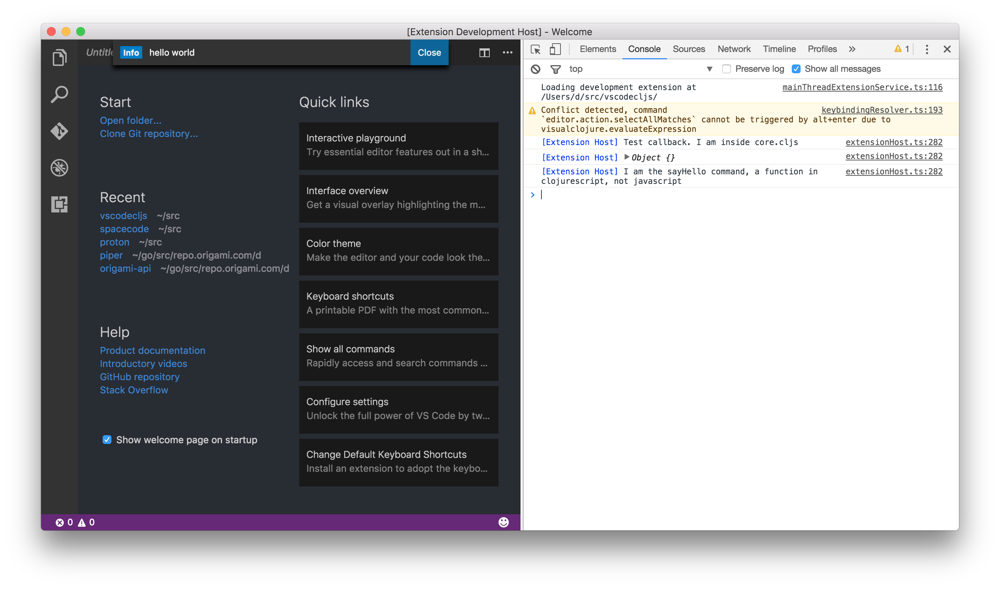

# README

This is a very simple proof of concept to see how vscode extensions could be written in ClojureScript instead of ts/js



## Compiling

### With figwheel
```
lein figwheel
```

### Without figwheel
```
lein cljsbuild <auto/once> min
```

## Loading into vscode
```
code --extensionDevelopmentPath=<path/to/this/repo>
```

This will open a new vscode window with the extension loaded into it. Check the developer tools console for debug output.

Hit CMD+Shift+P to open the command pallete and execute 'Hello World'. This will load our extension and call the `activate` function.